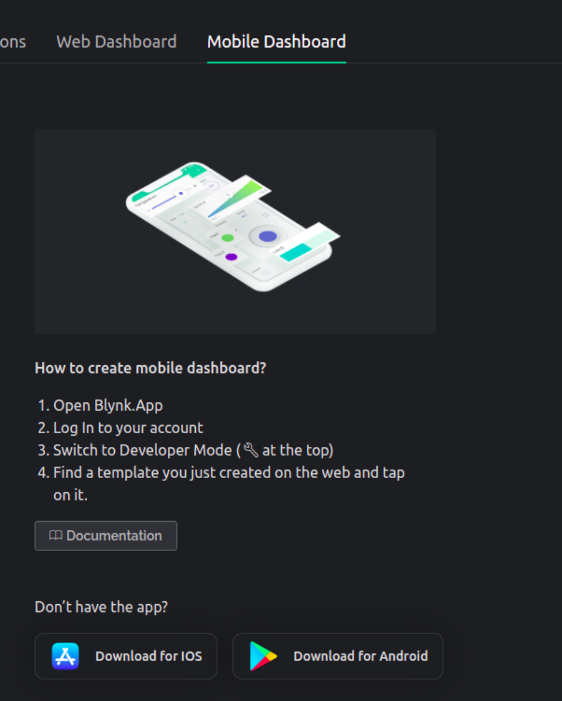

# MVP - Portão Eletrônico


#### Aqui é um exemplo de MVP da disciplina de Projetos de IoT


#### A estrutura do projeto abrange:


####  - Foi adaptado um controle de portão 433 MHz; 
####  - Para fazer as adaptações é necessário que o circuito não seja SMD;
####  - Por isso foi utilizado um controle com circuito PTH;
####  - Foi soldado dois fios entre os pushbuttons;
####  - Utilização de relé de 3V com optoacoplador.


#### Para programação do NodeMCU8266 


> Tome cuidado ao fazer o `git clone`, pois a path não está configurada para seu computador, é melhor criar um novo projeto em platformIO, e copiar e colocar o código em `main.cpp`.


 [Blynk](https://blynk.io/), acesse e crie sua conta, pegue as credências e defina as seguintes variáveis.


```js
#define BLYNK_TEMPLATE_ID "INSIRA_SEU_ID"
#define BLYNK_DEVICE_NAME "portão"
#define BLYNK_AUTH_TOKEN "INSIRA_SEU_TOKEN"
#define BLYNK_PRINT Serial
```
Configure sua rede Wi-Fi

```js
char auth[] = BLYNK_AUTH_TOKEN;
char ssid[] = "NOME_REDE";
char pass[] = "SENHA";
```
Configure uma função chamada pino virtual, nesse caso foi configurado o V1.

```js
BLYNK_WRITE(V1) //FUNÇÃO PINO VIRTUAL
{
  int portao = 12; //D6
  pinMode(portao, OUTPUT);
  int pinValue = param.asInt(); //PINO VIRTUAL BLYNK
  Serial.println(pinValue);
   
  if(pinValue == 1){ digitalWrite(portao, HIGH);
                     delay (200); 
                     digitalWrite(portao, LOW);}
}
```
Para configurar isso na plataforma Blynk.




