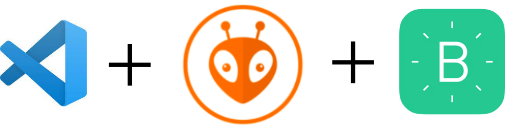

# MVP - Portão Eletrônico

#### Aqui é um exemplo de MVP da disciplina de Projetos de IoT

#### A estrutura do projeto abrange:

####  - Foi adaptado um controle de portão 433 MHz; 
####  - Para fazer as adaptações é necessário que o circuito não seja SMD;
####  - Por isso foi utilizado um controle com circuito PTH;
####  - Foi soldado dois fios entre os pushbuttons;
####  - Utilização de relé de 3V com optoacoplador.

#### Para programação do NodeMCU8266 

