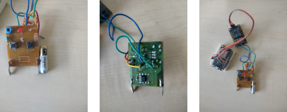
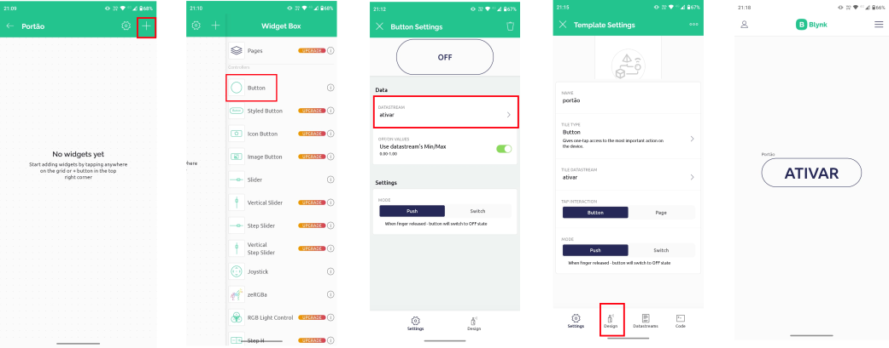

<h1 align="center"> MVP Portão Eletrônico IoT</h1>


<p align="center">

</p>

<h1 align="center"> :electric_plug: Estrutura do Projeto :electric_plug: </h1>

<p align="center">

</p>


> - Foi adaptado um controle de portão 433 MHz; 
> - Para fazer as adaptações é necessário que o circuito não seja SMD;
> - Por isso foi utilizado um controle com circuito PTH;
> - Foi soldado dois fios entre os pushbuttons;
> - Utilize um relé de 3V com optoacoplador.

<p align="center">

</p>

<p align="center">

</p>

<h1 align="center"> :computer: Programação :computer: </h1>

<p align="center">

</p>

> Tome cuidado ao fazer o `git clone`, pois a path (.vscode) não está configurada para seu computador, por essa razão é melhor criar um novo projeto na  platformIO e depois copiar e colocar o código no arquivo `main.cpp`, que se encontra no diretório `src`.


 [Blynk](https://blynk.io/), acesse e crie sua conta, pegue as credências e defina as seguintes variáveis.


```js
#define BLYNK_TEMPLATE_ID "INSIRA_SEU_ID"
#define BLYNK_DEVICE_NAME "portão"
#define BLYNK_AUTH_TOKEN "INSIRA_SEU_TOKEN"
#define BLYNK_PRINT Serial
```
Configure sua rede Wi-Fi

```js
char auth[] = BLYNK_AUTH_TOKEN;
char ssid[] = "NOME_REDE";
char pass[] = "SENHA";
```
Configure uma função chamada pino virtual, nesse caso foi configurado o V1.

```js
BLYNK_WRITE(V1) //FUNÇÃO PINO VIRTUAL
{
  int portao = 12; //D6
  pinMode(portao, OUTPUT);
  int pinValue = param.asInt(); //PINO VIRTUAL BLYNK
  Serial.println(pinValue);
   
  if(pinValue == 1){ digitalWrite(portao, HIGH);
                     delay (200); 
                     digitalWrite(portao, LOW);}
}
```
Para configurar isso na plataforma Blynk.


  Baixe o APP do Blynk, em seu celular.



`Virtual Pin` é um conceito inventado pela Blynk, para fornecer quaisquer dados entre o hardware e o aplicativo móvel. 
Os pinos virtuais permitem a interface com qualquer atuador ou sensor.

Lembre-se que os pinos virtuais não possuem propriedades físicas.

```js
 int pinValue = param.asInt(); //PINO VIRTUAL BLYNK
```

# Contribua 

1 - Fork it

2 - Cria sua feature branch (git checkout -b my-new-feature)

3 - Commit suas mudanças (git commit -am "Added some feature")

4 - Push na sua branch (git push origin my-new-feature)

5 - Crie novo Pull Request
